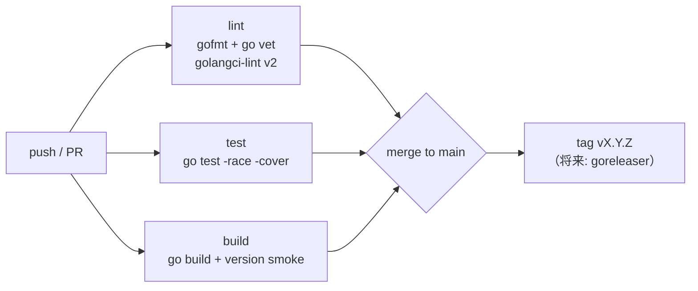

# pvectl 開発プロセス設計書

個人開発 OSS。プロセスは軽量カンバン（GitHub Issues）+ t_wada 流 TDD + Trunk 近縁のブランチ運用。

## 1. TDD（t_wada 流 Red-Green-Refactor）

すべての機能追加・バグ修正はテストから書く。

```
1. Red      失敗するテストを書く（コンパイルエラーも Red）
2. Green    テストを通す最小の実装を書く
3. Refactor テストを green に保ったまま整理する
```

- **バグ修正は必ず再現テストから**。M1 で修正した旧実装の欠陥（cloud-init 未送信・クローン時フィールド破棄・--context 無視・UPID 非待機）はすべて回帰テストで固定済み
- テスト対象の層と使う道具:

| 層 | 道具 | 例 |
|---|---|---|
| 純関数（diff/convert/normalize/validate） | テーブルテスト | `internal/diff`, `resource/vm/convert_test.go` |
| 出力 | golden file（`-update` で再生成） | `internal/printer/testdata/` |
| リソースハンドラ | `apitest.Fake`（api.Client のフェイク） | `resource/vm/apply_test.go` |
| SDK ラッパー | `test/pvefake`（httptest 製フェイク PVE API） | `internal/api/client_test.go` |
| コマンド | cobra `SetArgs` + フェイク Factory | `internal/cmd/cmd_test.go` |
| e2e | 実 SDK クライアント → pvefake をフルスタック | `test/e2e/` |

- `examples/` のマニフェストはテストからもパースされる（ドキュメントの腐敗防止）
- **実クラスタはテストに不要**。pvefake が ticket ログイン・token 認証・タスク(UPID)ポーリングまで模倣する

## 2. 開発環境（コンテナ完結）

ローカルを汚さない。ビルド・テスト・lint はすべて dev コンテナ内で実行する。

```bash
make dev-up      # golang:1.26-alpine + golangci-lint v2.12.2 のコンテナを起動
make check       # vet + lint + race テスト（コンテナ内）
make build       # ldflags 付きビルド
```

- ソースはバインドマウント（ホストのエディタで編集 → 即反映）、go mod/build キャッシュは名前付きボリューム
- VS Code 利用時は `.devcontainer/devcontainer.json` で同じコンテナにアタッチ可能
- シークレット（`.env` 等）はコンテナにマウントしない・読まない

## 3. ブランチ / コミット

- `main` = リリース可能。作業は短命ブランチ → PR → squash/merge
- コミットは Conventional Commits + gitmoji（`.gitmessage` 参照、日本語可）
- git 操作（add/commit/push）は人間が実行する

## 4. CI パイプライン（GitHub Actions）



- `.github/workflows/ci.yaml`: lint / test / build の 3 ジョブ並列。Go バージョンは `go.mod` に追従（`go-version-file`）
- dependabot: gomod / github-actions / docker を週次。Telmate SDK は semver 無しのため PR ベースで検証して取り込む（ADR-002）
- カバレッジは計測・表示のみ（M1 では閾値ゲートなし）

## 5. リリースチェックリスト（M1 = v0.1.0）

- [ ] `make check` クリーン（vet + golangci-lint + `go test -race ./...`）
- [ ] 回帰チェックリスト通過:
  - [ ] `--context` / `--config` / `PVECTL_*` が実際に効く（`TestContextFlagIsHonored`）
  - [ ] 全 mutation がタスク完了を待つ（`TestTaskFailureSurfaces`）
  - [ ] クローン後にマニフェストの設定が適用される（`TestCloneFlow`）
  - [ ] cloud-init / cpu type / disk cache が API に送信される（`TestCreateParams`）
  - [ ] 同一マニフェスト再 apply が `unchanged`（`TestApplyCreatesAndIsIdempotent`）
  - [ ] `get -o yaml` → `apply` round-trip が `unchanged`（`TestGetYAMLRoundTrip`）
- [ ] 実クラスタ手動スモーク: `get vm` → `apply --dry-run=server` → `diff` → `apply` → `delete`
- [ ] README / docs / examples が実装と一致
- [ ] `git tag v0.1.0` + `make build` で version が埋まることを確認

## 6. 将来（M2 以降で検討）

- goreleaser によるバイナリ配布（macOS/Linux, arm64/amd64）
- カバレッジ閾値ゲート
- 実クラスタに対する nightly 統合テスト（オプトイン）
