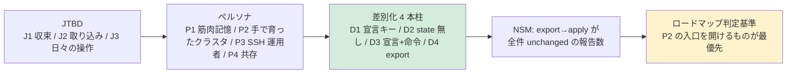

# Discovery Brief: pvectl

- **作成**: 2026-09-22 / 射程: 自宅ラボ〜小規模チーム（現行 PRD 準拠）
- 詳細: [discovery/context.md](discovery/context.md) / [discovery/problem-space.md](discovery/problem-space.md) / [discovery/solution-space.md](discovery/solution-space.md)

## 1. Problem Statement

- **対象ユーザー**: P2「手で育ったクラスタを抱える小規模チームの担当者」を主、P1「平日 k8s・週末 Proxmox」を早期採用者、P3「SSH で `qm` を叩く運用者」を入口とする
- **ジョブ**: J1 収束 / **J2 既存クラスタの取り込み** / J3 日々の操作。既存手段はどれも 3 つを同時に満たさない
- **既存の選択肢が不十分な理由**: Terraform は J1 に特化し J3 を原理的に持たない。`terraform import` は state に取り込むだけで J2 を片付けない。`qm` はノード上でしか動かない

## 2. Solution Hypothesis

- **ポジショニング**: Terraform は Proxmox を「構築する」ツール、pvectl は Proxmox を「運用する」ツール
- **価値提案**: 既存クラスタを壊さずに、1 台ずつ・1 フィールドずつ宣言的管理へ移せる唯一の手段
- **NSM**: 「export → apply が全件 `unchanged`」を達成したクラスタの報告数（代理指標であることを明示する）
- **3 ヶ月後（2026-12）の定義**: 自分以外の 1 クラスタで上記が報告されること

## 3. 仮定と検証状況

| 仮定 | 重要度 | 状況 | 根拠 |
|---|---|---|---|
| A1. Terraform の劣位は実装品質ではなくスキーマの表現力に由来する | High | ✅ 検証済 | bpg v0.113.1 の自己記述（optional+computed）と `proxmox_cloned_vm` EXPERIMENTAL の存在（ADR-005） |
| A2. 既存クラスタの取り込みが IaC 化の最大の障害である | High | ⚠️ 未検証 | 競合が一級機能を持たないという傍証のみ。**当事者の声が無い** |
| A3. P2 は export があれば管理下へ移行する | High | ⚠️ 未検証 | 実装前のため検証不能。export 出荷が最初の検証手段そのものになる |
| A4. 宣言と命令の同居（D3）が日常の採用理由になる | Medium | ⚠️ 未検証 | 自分の運用では成立。外部の報告なし |
| A5. 2-way merge（消しても戻らない）が不具合報告を招かない | Medium | ⚠️ 監視中 | ADR-005 が周知の継続を条件として挙げている |

**最も安い検証**: A2 を Proxmox コミュニティ / GitHub Discussion への 1 本の問い（「UI で作った VM の IaC 化をどこで諦めたか」）で当たる。実装前に打てる。

## 4. 差別化 4 本柱（採用導線の素材）

| | 主張 | 状態 |
|---|---|---|
| D1 | 宣言キーのみを管理する。書いていないものは差分にならない | ✅ v0.1.0 |
| D2 | state ファイルを持たない。サーバーが唯一の真実 | ✅ v0.1.0 |
| D3 | 宣言（`apply` / `runStrategy`）と命令（`exec` / `migrate`）が 1 バイナリ | ✅ v0.1.0 |
| D4 | live → マニフェストの `export` | ❌ 未実装 — **唯一の空き地** |

**降りる場所**（README に書いてよい）: 複数プロバイダ横断の依存グラフ / 大量生成 / 一括破棄 / 同時 apply の調停 / plan 承認エコシステム。

## 5. Priority Backlog

| 項目 | 優先 | 根拠 |
|---|---|---|
| `export` 動詞 + e2e 保証（export → apply が全件 `unchanged`） | **P0** | D4 を実在させ、P2 の入口を開ける唯一の手段。NSM に直結 |
| README の Why を 4 本柱 + 降りる場所に書き換え | P0 | 既存資産の言語化のみ。実装コスト無し |
| A2 の検証（コミュニティへの 1 問） | P0 | 実装前に打てる。外れれば P0 の順序が変わる |
| M2 LXC（`kind: Container`） | P1 | 既存層の適用範囲拡大。競合も持つ領域 |
| M3 以降（Storage / Network / Snapshot） | P2 | SDN の二段階コミットは D3 の実証材料になる |
| 大量生成・`--prune`・同時実行ロック | **Won't** | 非ターゲット層のためだけの機能（ADR-005 非目標） |

## 6. Key Risks & Open Questions

- **R1. export 不在のまま採用導線だけ整えると、P2 が来ても入口が無い** → 文言の書き換えと export 実装を同じ版に載せる
- **R2. 「Terraform より軽い」と言うと P4 を敵に回す** → 主張は所有権モデルの差に固定し、共存パターンを README に明記する
- **R3. A2 が外れた場合**（真の障害が取り込みではなく学習コストだった） → P0 は export ではなく quick-start の短縮になる。検証を先に打つ理由
- **Q1（要ユーザー判断）. `v0.2.0` を export に入れ替え、LXC を `v0.3.0` に下げるか** — 現行 PRD は M2=LXC。ADR-005 §5 の決定自体は有効なので、変更は PRD のマイルストーン順のみで足りる

## 7. Next Steps

- [ ] Q1 の裁定（export 先行か、PRD 通り LXC 先行か）
- [ ] 裁定後、README の Why / PRD §1・§7 / ADR-005 追補への反映を worktree の PR として起こす
- [ ] A2 の検証を 1 問で打つ
- [ ] 実装設計が要る段階で arch-requirements へ引き渡す
