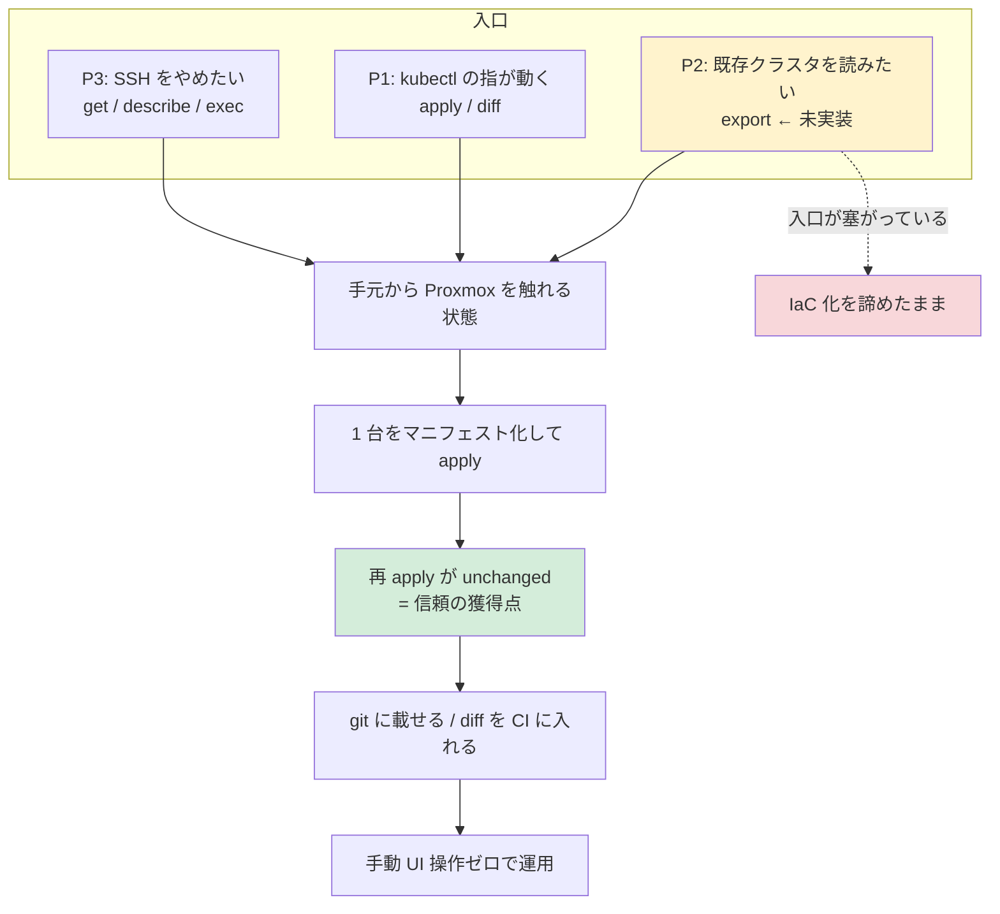

# Problem Space — 誰が、どんなジョブのために pvectl を雇うか

- **作成**: 2026-09-22
- 前提: [context.md](context.md)

## 1. 片付けたい仕事（JTBD）

Proxmox VE の利用者が抱えるジョブを 3 つに分解する。既存手段はそれぞれ**一部しか**片付けない。

| # | ジョブ（Job Statement） | Web UI | `qm` / `pvesh` | Terraform | pvectl |
|---|---|---|---|---|---|
| **J1 収束** | 構成を書いた通りの状態に戻したい。何度実行しても同じ結果であってほしい | ✗ | ✗ | ✓ | ✓ |
| **J2 取り込み** | 手で作ってしまった既存 VM を、壊さずに構成として読み取れる形にしたい | ✗ | ✗ | △ import は state に入れるだけ | **◎ export（未実装・最大の空き地）** |
| **J3 日々の操作** | 起動・停止・中で 1 コマンド実行・ノード間移動を、手元から今すぐやりたい | ✓ | △ SSH 必須 | ✗ | ✓ |

**発見**: 既存手段はどれも J1〜J3 を同時に満たさない。Terraform は J1 に特化し、J3 を原理的に持たない（1 回限りの操作は望ましい状態として表現できない）。`qm` は J3 を持つがノード上でしか動かない。
**pvectl の存在理由は「J1 と J3 を同じバイナリで持つこと」であり、J2 がまだ誰にも押さえられていない。**

## 2. Terraform が構造的に片付けられない理由（ADR-005 の要約）

実装品質の差ではなくモデルの差である、という点が重要。

- Terraform のスキーマは「ユーザーが宣言したか」と「値が空か」を区別できない。クローン継承値を表現するには全属性を optional かつ computed にするしかなく、plan にノイズが乗る
- bpg 自身が `proxmox_cloned_vm`（EXPERIMENTAL）で pvectl の managed-keys とほぼ同じ思想に到達しているが、cloud-init・BIOS・TPM・パススルーなどが管理対象外として除外され、tfstate も依然必要
- SDN の pending → reload のような CRUD に収まらない書き込みは、ダミーリソース + `replace_triggered_by` での回避になる

## 3. ペルソナ

### P1. 平日 k8s・週末 Proxmox の「筋肉記憶」層 — ケイ（30 代・SRE）

| | |
|---|---|
| 環境 | 自宅 1〜2 ノード、VM 10〜30 台。職場では Terraform と kubectl を毎日使う |
| ジョブ | J1 収束 / J3 日々の操作。「壊したラボを宣言から 5 分で戻したい」「何を変えたか git log で説明できる状態にしたい」 |
| 現在の痛み | 自宅に Terraform を持ち込むと state の置き場・ロック・provider 更新が付いてくる。得るものに対して手当が重い。かといって Web UI は再現性がない |
| 採用のトリガ | `go install` 一発。`get` / `describe` / `apply` / `diff` が**説明書なしで指が動く** |
| 決め手 | 再 apply が `unchanged` で書き込みゼロ。diff の exit code が CI に載る |
| 離脱リスク | 既に自宅でも Terraform を回している場合、乗り換え動機が弱い → **J3（運用動詞）と J2（export）でしか説得できない** |

### P2. 手で育ったクラスタを抱える小規模チームの担当者 — ナオ（40 代・情シス兼インフラ）

| | |
|---|---|
| 環境 | 3〜5 人のチーム、VM 50〜150 台。数年かけて Web UI で作られ、誰も全体像を書き出せない |
| ジョブ | **J2 取り込みが最優先**。「今あるものを壊さずに、まず読み取り可能にしたい」 |
| 現在の痛み | IaC 化を試みて `terraform import` で挫折した経験がある。ドリフトが怖くて誰も `apply` を押せない。「触ると壊れる」が常態 |
| 採用のトリガ | **export の出力をそのまま apply して全件 `unchanged`**。差分ゼロを機械的に証明できること |
| 決め手 | 宣言キーのみの原理 = サーバー既定値を書き戻さない = **段階的に管理下へ移せる**。1 台ずつ、1 フィールドずつ IaC 化できる |
| 離脱リスク | export が無い現状では、このペルソナは**まだ入口を持たない**。v0.1.0 の最大の欠損 |

> P2 は「Terraform から乗り換える人」ではなく「**IaC をまだ始められていない人**」である。ここが Terraform と客を奪い合わない最大の市場。

### P3. シェルスクリプトで回している運用者 — トオル（20 代・オンプレ運用）

| | |
|---|---|
| 環境 | ノードに SSH して `qm` を叩く手順書とスクリプトの束。宣言的 IaC への関心は薄い |
| ジョブ | **J3 日々の操作**。「ノードに SSH せずに手元から一括で操作したい」 |
| 現在の痛み | `qm` はノード上でしか動かない。API を curl で叩くと認証と UPID 待ちを自前で書くことになる。タスク失敗が exit code に出ない |
| 採用のトリガ | 単一バイナリ。`exec` / `migrate` / `start` / `stop` がタスク完了まで待ち、失敗が非 0 で返る |
| 決め手 | マニフェストを 1 行も書かずに `get` / `describe` / `exec` だけで価値が出る |
| 位置づけ | **採用ファネルの入口**。宣言的管理はこの人にとって「後から効いてくる機能」であり、最初の売り文句にしてはいけない |

### P4. Terraform でマルチクラウドを統括している SRE — （共存ターゲット・奪わない）

DNS・証明書・クラウド側リソースと Proxmox を 1 つの依存グラフで扱う必要があるなら、Terraform が正しい。pvectl はそこを置き換えない。
**共存の形**: Terraform で VM をプロビジョン → pvectl で日々の `diff` 検査と `exec` / `migrate` / 起動停止。この層に対しては「乗り換えろ」ではなく「**足せ**」と言う。

### 非ターゲット（明示的に降りる）

| 層 | 降りる理由 |
|---|---|
| 学期ごとに学生用 VM を 100 台一括生成する教育機関 | `for_each` / モジュール相当の生成表現を持たない。YAML の外でテンプレート化が必要で、Terraform のほうが素直 |
| 複数人が同時に apply するチーム | state を持たない = ロックを持たない。同時実行の調停は Proxmox 側のタスクロック頼み |
| 「作ったものを一括で消す」運用 | `--prune` は非目標（ADR-005）。所有権表明の設計が固まるまで扱わない |
| Proxmox クラスタ自体の構築・ノード追加 | 非目標 |

## 4. 採用経路（誰がどこから入って、どこで定着するか）

**この図の含意**: 信頼の獲得点は「再 apply が `unchanged`」の 1 点に集中している。ここを体験させるまでの歩数を減らすことが採用導線の設計目標であり、P2 についてはその歩数が現状 **∞（入口が無い）**。
