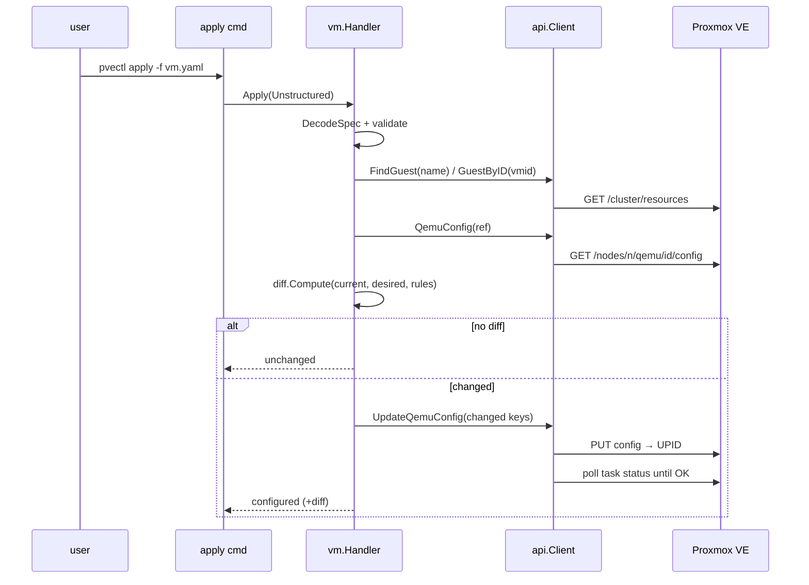

# pvectl PRD（プロダクト要件定義書）

- **プロダクト名**: pvectl
- **一言定義**: Proxmox VE を kubectl と同じ体験で操作し、YAML/JSON マニフェストで宣言的に管理できる CLI
- **対象ユーザー**: Kubernetes の操作感に慣れており、自宅ラボ〜小規模クラスタの Proxmox VE を IaC で管理したい個人・小規模チーム
- **リポジトリ**: github.com/cyokozai/pvectl（MIT License）

## 1. 背景と課題

Proxmox VE の操作手段は Web UI・`qm`/`pct` CLI・REST API だが、

- Web UI は再現性がなく、構成のレビュー・バージョン管理ができない
- `qm` は命令的で、ノードに SSH する必要がある
- Terraform Provider は重量級で、単発の操作（start/stop/describe）に向かない

kubectl ユーザーにとって馴染みのある「宣言的マニフェスト + 冪等 apply + 観測用動詞」のモデルを Proxmox VE に持ち込むことで、このギャップを埋める。

## 2. ゴール

1. **kubectl-like UX** — `get` / `describe` / `apply` / `diff` / `delete` / `start` / `stop` を全リソース共通の動詞として提供する
2. **宣言的管理（IaC）** — `{apiVersion, kind, metadata, spec}` 形式の YAML/JSON マニフェストで状態を記述し、`apply` は冪等（再実行しても安全）
3. **マルチコンテキスト** — kubeconfig 型の `~/.pvectl/config` で複数クラスタ・複数認証を切り替える
4. **タスク完全待機** — すべての mutation は Proxmox タスク (UPID) の完了を待ち、exit status をエラーとして表面化する

### 非ゴール（v0 では扱わない）

- watch / コントローラ型の常駐リコンサイル（apply は一回限りの収束）
- `apply --prune`（マニフェストにないリソースの削除）
- VM のライブマイグレーション（`targetNode` 変更はエラーにする）
- Proxmox クラスタ自体の構築・ノード管理

## 3. kubectl パリティ表

| kubectl | pvectl | 状態 |
|---------|--------|------|
| `get TYPE [NAME]` (`-o table/wide/yaml/json/name`) | 同一 | ✅ M1 |
| `describe TYPE NAME` | 同一 | ✅ M1 |
| `apply -f`（冪等・複数 `-f`・dir・stdin・マルチdoc） | 同一 | ✅ M1 |
| `apply --dry-run=client\|server` | 同一 | ✅ M1 |
| `diff -f`（exit 0/1/>1） | 同一 | ✅ M1 |
| `delete TYPE NAME` / `delete -f` | 同一 | ✅ M1 |
| `config get-contexts/current-context/use-context/view` | 同一 | ✅ M1 |
| `completion bash/zsh/fish` | cobra 標準 | ✅ M1 |
| `--context` / `--kubeconfig`（→ `--config`） | 同一 | ✅ M1 |
| `logs` / `exec` | 対応なし（将来: シリアルコンソール検討） | ➖ |

## 4. マイルストーン

| マイルストーン | スコープ | リリース条件 |
|---|---|---|
| **M1** | `VirtualMachine`（qemu）完全対応: 冪等 apply / diff / dry-run / clone+再設定 / cloud-init / disk resize / lifecycle | 回帰チェックリスト全通過・CI green・docs 完備 → `v0.1.0` |
| M2 | `Container`（LXC）: `FindGuest` の一般化、`ostemplate`/`rootfs`/`mountPoints` | 同上 → `v0.2.0` |
| M3 | `Storage` / `Network`（pending+reload モデル）/ `Snapshot`（動詞主体） | `v0.3.0` |
| M4 | `Pool` / `User`(+token) / `ACL`（set 調停）/ `HA` | `v0.4.0` |

新しい kind は `resource.Handler` を実装して `Register()` する 1 行で全動詞に接続される（ADR-001）。

## 5. アーキテクチャ

```mermaid
graph LR
    subgraph CLI
        CMD[internal/cmd<br/>cobra verbs] --> FACT[internal/cliopt<br/>Factory]
        CMD --> REG[internal/resource<br/>Registry]
    end
    subgraph Resources
        REG --> VM[resource/vm<br/>M1]
        REG --> LXC[resource/lxc<br/>M2]
        REG --> MORE[storage/network/...<br/>M3-M4]
    end
    subgraph IO
        CMD --> RT[internal/runtime<br/>manifest decoder]
        CMD --> PR[internal/printer<br/>table/yaml/json]
        VM --> DIFF[internal/diff<br/>managed-key diff]
    end
    subgraph API
        FACT --> API[internal/api<br/>Client interface]
        VM --> API
        API --> TEL[telmate.go<br/>SDK wrapper]
        TEL --> PVE[(Proxmox VE<br/>/api2/json)]
    end
    CFG[~/.pvectl/config<br/>internal/config] --> FACT
```

### apply シーケンス（更新パス）



## 6. 非機能要件

| 項目 | 要件 |
|---|---|
| 信頼性 | mutation は必ずタスク完了を待つ（`--timeout` 既定 5m）。タスク失敗は非 0 exit + exit status 表示 |
| 冪等性 | 同一マニフェストの再 apply は `unchanged`・API 書き込みゼロ |
| 安全性 | immutable 変更（vmid/targetNode/disk縮小/storage変更）はエラー。**暗黙の再作成・削除は絶対にしない** |
| セキュリティ | config は 0600 で保存。`config view` はトークン/パスワードを REDACTED。cipassword は write-only |
| テスト容易性 | 実クラスタ不要：SDK ラッパーは `test/pvefake`（httptest 製フェイク PVE）で、ハンドラは `apitest.Fake` で検証 |
| 互換性 | Go 1.26。SDK は commit 固定（ADR-002）。`go install` 一発で導入可能 |

## 7. 成功指標（個人 OSS として）

- 自分の Proxmox クラスタの全 VM がマニフェスト管理下にあり、手動 UI 操作ゼロで運用できる
- `apply → diff` のループが CI（GitOps）に組み込める（exit code 契約）
- M2 以降の kind 追加が「handler 実装 + Register 1 行 + テスト」で完結する
